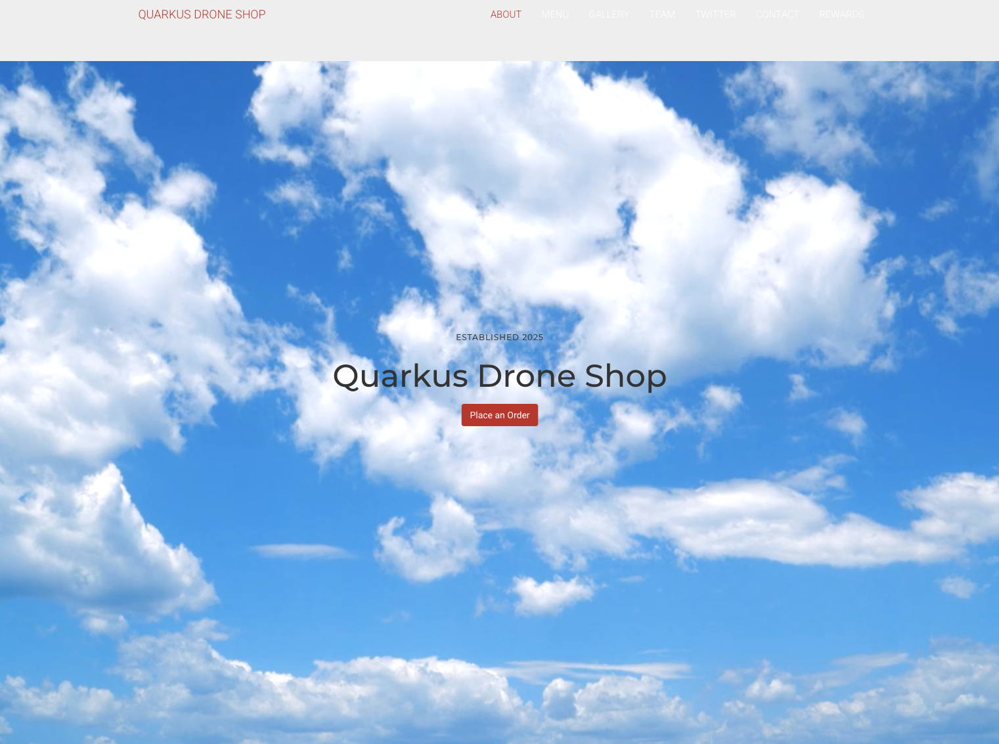

# Docs

quarkuscoffeeshopを使ったDataMeshのデモアプリになります。

オリジナルサイトは下記をご覧ください。
Please see the Github Pages Site for complete documentation: [quarkuscoffeeshop.github.io](https://quarkuscoffeeshop.github.io)

QuarkusCoffeeshop Install
=========

_NOTE:_ Ansible must be installed https://docs.ansible.com/ansible/latest/installation_guide/index.html

The QuarkusCoffeeshop Ansbile Role performs a basic installation that includes the microservices for a coffeeshop, installation of the Crunchy PostgreSQL DB, AMQ Streams (Kafka.)

The QuarkusCoffeeshop Role will deploy an event-driven demo application built with Quarkus, AMQ Streams (Kafka), and MongoDB. The application deploys to OpenShift (Kubernetes.)
The source code for the  [quarkuscoffeeshop](https://github.com/quarkuscoffeeshop) application support doc can be found  [here](https://github.com/quarkuscoffeeshop/quarkuscoffeeshop-support).

※ MongoDBはテスト用なのでデモでは利用しません。

Requirements
------------
* OpenShift 4.16 an up Cluster installed
* Docker or podman

Currently tested on 
-------------------
* OpenShift 4.16.2
* OpenShift Pipelines: 1.9.0
* AMQ Streams: 2.9.0-2
* Postgres Operator: v5.8.2

ScreenShots
------------------------------------------------


http://quarkuscoffeeshop-web-quarkus-cafe-demo.apps.example.com example


Usage
----------------
* Default web page 5.0.1-SNAPSHOT  
  * http://quarkuscoffeeshop-web-quarkus-cafe-demo.apps.example.com/
this endpoint is used to view the events coming into the cluster
* Default web page v3.3.1  
  * http://quarkuscoffeeshop-web-quarkus-cafe-demo.apps.example.com/cafe
this endpoint is used to view the events coming into the cluster
* If you deploy skip_quarkus_cafe_customermock this will automatically push events to the quarkus cafe dashboard.
* If you would like to manally push events to AMQ use the command below.

```shell
export ENDPOINT="quarkuscoffeeshop-web-quarkus-cafe-demo.apps.ocp4.example.com"
curl  --request POST http://${ENDPOINT}/order \
--header 'Content-Type: application/json' \
--header 'Accept: application/json' \
-d '{
    "beverages": [
        {
            "item": "COFFEE_WITH_ROOM",
            "name": "Mickey"
        },
        {
            "item": "CAPPUCCINO",
            "name": "Minnie"
        }
    ],
    "kitchenOrders": [
        {
            "item": "CAKEPOP",
            "name": "Mickey"
        },
        {
            "item": "CROISSANT",
            "name": "Minnie"
        }
    ]
}'
```

## Developer Notes
> To develop and modifiy code 
* OpenShift 4.16 an up Cluster installed
* Ansible should be installed on machine
* oc cli must be installed
* Ansible community.kubernetes module must be installed `ansible-galaxy collection install community.kubernetes`
* [Postges Operator](https://github.com/tosin2013/postgres-operator) for Quarkus CoffeeShop 5.0.1-SNAPSHOT Deployments
* pip3 
* プロビジョニングはMacで実施しています
* OpenShift CLI (oc) コマンドをインストールしていること
* figlet をコマンドをインストールしていること
* The kustomize コマンドをインストールしていること
* The tektoncd-cli コマンドをインストールしていること
* skupper(innerconect2.0) コマンドをインストールしていること
* オリジナルサイトではHelmによるインストールも紹介されているが、アプリが最新でないので、Pipline.shを使ったデプロイを推奨する。

Ansible Role Variables
--------------
Type  | Description  | Default Value
--|---|--
deployment_method | docker or s2i build | docker
skip_amq_install |  Skip Red Hat AMQ Install  |  false
skip_mongodb_operator_install |  Skip MongoDB Operator Install  |  false
single_mongodb_install | Skip single instance mongodb | false
skip_quarkuscoffeeshop_helm_install |  Skip quarkuscoffeeshop helm chart install  |  false
openshift_token | OpenShift login token  | 123456789
openshift_url | OpenShift target url  | https://master.example.com
project_namespace | OpenShift Project name for the quarkus-cafe | quarkuscoffeeshop-demo
insecure_skip_tls_verify  |  Skip insecure tls verify  |  true
default_owner | Default owner of template files. | root
default_group | Default group of template files. |  root
delete_deployment  | delete the deployment and project for quarkuscoffeeshop-demo  | false
amqstartingCSV  | Red Hat AMQ csv version  |  amqstreams.v2.9.0-2
mongodbstartingCSV  | MongoDB Ops Manager version  |  mongodb-enterprise.v1.8.0
config_location  | default location for application templates  | "/tmp/"
version_barista | Default container barista tag | 5.0.0-SNAPSHOT
version_counter | Default container counter tag | 5.0.1-SNAPSHOT
version_customermocker | Default container customermocker tag | 3.0.1
version_kitchen | Default container kitchen tag | 5.0.0-SNAPSHOT
version_web | Default container web tag | 5.0.1-SNAPSHOT
helm_chart_version | Version of Qaurkus Cafe Helm Chart | 3.4.4
pgsql_username | Default postgress user  | coffeeshopadmin
postgres_password | this is the postgress password that will be used in deployment| must be changed
pgsql_url | default postgres URL | 'jdbc:postgresql://coffeeshopdb:5432/coffeeshopdb?currentSchema=coffeeshop'
storeid | Store id for web frontend | RALEIGH
quarkus_log_level | Quarkus coffee shop log level |  INFO
quarkuscoffeeshop_log_level | Microservice log level | DEBUG

OpenShiftへのデプロイ手順
---------------

### 事前作業
事前に、OpenShiftクラスタの作成と、ログインを済ませておいてください。
次に下記プロジェクトをCloneします。
（オリジナルサイトのアプリでなく同Gitアカウント上にリポジトリを利用してください）

* quarkuscoffeeshop-web
* quarkuscoffeeshop-counter
* quarkuscoffeeshop-kitchen
* quarkuscoffeeshop-barista
* quarkuscoffeeshop-inventory
* homeoffice-backend
* quarkuscoffeeshop-homeoffice-ui

クラスタは下記のようなシングルノードで問題ありません。ただし、3クラスタ作成しておいてください。
https://catalog.demo.redhat.com/catalog?search=single&item=babylon-catalog-prod%2Fsandboxes-gpte.ocp4-single-node.prod

### 環境設定ファイルの作成
ディレクトリ直下に、source.envというファイル名で、下記のような設定ファイルを作成してください。

```
CLUSTER_DOMAIN_NAME=<<CLUSTER DOMAIN>>
TOKEN=<<CLUSTER TOKEN>>
ACM_WORKLOADS=n
AMQ_STREAMS=y
CONFIGURE_POSTGRES=y
MONGODB_OPERATOR=n
MONGODB=n
HELM_DEPLOYMENT=n
DELETE_DEPLOYMENT=false
DEBUG=-v
```

### Ansibleの実行（A/B/Cサイト共通実行）
次に、対象のOpenShiftクラスタに対して、KafkaやPostgresなどのミドルウエアをインストールします。
下記コマンドで実行してください。（数分かかります）

```
./ocpdeploy.sh setup
```

### OpenShift Pipline を使ってアプリのデプロイを行う（A/B/Cサイト共通実行）
その後、piplines.sh にて各アプリのデプロイを行います。下記コマンドを順に実行します。
Operatorのインストール後、デプロイするアプリを選択するメニューがでますので、自ドメインにデプロイするアプリを選択してください。
メニューを完了するには、キャンセルを選択してください。

```
./piplines.sh setup
./piplines.sh deploy
./piplines.sh democonfig
```

Piplineは、quarkuscoffeeshop-cicdプロジェクトに作成されます。
OpenShiftコンソールにあるPiplineメニューから、アプリデプロイを実行してください。
その際、PVCの選択を促されますが、アプリ名にあったPVCを適宜選択してください。

また、デプロイ推奨構成としては下記になります。
#### Aサイト
* quarkuscoffeeshop-web
* quarkuscoffeeshop-counter
#### Bサイト
* quarkuscoffeeshop-kitchen
* quarkuscoffeeshop-barista
* quarkuscoffeeshop-inventory
#### Cサイト
* homeoffice-backend
* quarkuscoffeeshop-homeoffice-ui

### DataMeshの準備
SiteA、SiteB、SiteCのミドルウエアとアプリのインストールが済んだ状況になっていると思います。
最後に、各サイト間にSkupperを張り、KafkaMirror2で相互にSyncします。
下記コマンドをそれぞれのSite上で実行してください。メニューが表示されるのでサイトを選択して構築します。
このシェルによりSite間の接続と、MirrorMaker2の接続ができます。

```
./skupper-and-kafkacluster.sh deploy
```

#### OpenMetadataの準備
最適なドメインににて、OpenMetadataをインストールします。
openmetadataプロジェクトが作成され、OpenMetadataがインストールされます。

```
./ocpdeploy.sh openmetadata
```

#### 環境削除
環境のリセットは下記コマンドで実施します。

```
./ocpdeploy.sh cleanup
```

To-Do
-------
* OpenMetadataの設定インポートを試す
* F2Fの自動テストする
* QuarkusバージョンとJavaのバージョンアップをする


Troubleshooting
---------------
#### Force delete kafka crds after bad install
```
oc get crds -o name | grep '.*\.strimzi\.io' | xargs -r -n 1 oc delete
```

#### プロジェクトがどうしても消えない場合の対策

リソースをすべて削除しても、最後にプロジェクトがどうしても残り続けるケースがあります。
その場合、下記シェルにて強制的に削除することができます。
> ただし、利用時にはドメインなど間違えないように注意してください。

```
./delete-project.sh
```

#### KafkaやPostgresのインスタンス生成で失敗するとき

Operatorがバージョンアップが変わっている可能性があります。
defaults/mailn.yamlのバージョンをオペレータに合わせて修正してください。
修正後反映するには、コミット、Pushまで行う必要があることに注意くしてください。
> ただし、Operatorの仕様が変わっている場合がありますので、バージョン変更だけでは直らないこともあります。

```
amqchannel: stable
amqstartingCSV: amqstreams.v2.9.0-2
mongodbstartingCSV: mongodb-enterprise.v1.32.0
crunchystartingCSV: postgresoperator.v5.8.2
```

#### 不要なKafkaTopicをすべて消したい場合の対策
> 利用時にはドメインなど間違えないように注意してください。

下記シェルにて、強制的に削除する。

```
./kafka-delete-topic.sh
```
#### Skapperでのサイト連携がうまくいかない場合

下記シェルにて、Skupperのステータスを表示できます。
```
./skupper-and-kafkacluster.sh status
```

接続がうまく言ってない場合、下記シェルにて、SkupperのToken作り直すことができます。
```
./skupper-and-kafkacluster.sh retoken
```

License
-------
GPLv3

Author Information
------------------
* This role was created in 2020 by [Tosin Akinosho](https://github.com/tosin2013)
* This role was updated in 2025 by [Noriaki Mushino](https://github.com/nmushino)